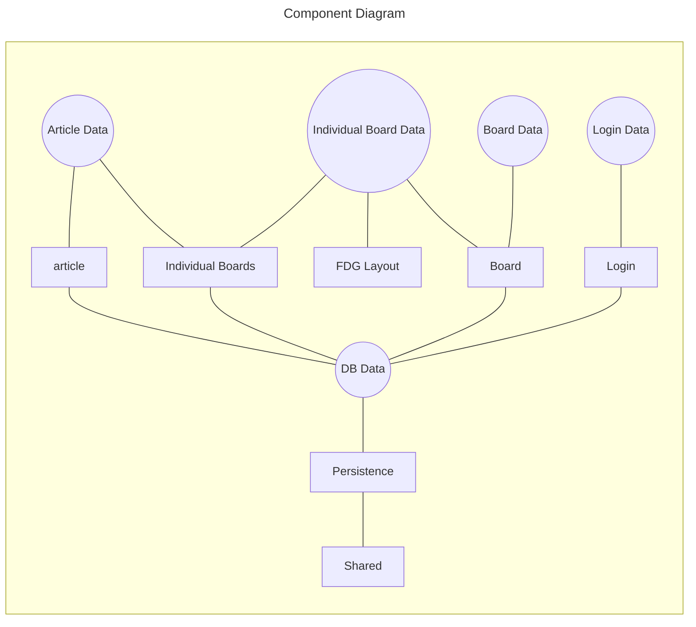

```mermaid
---
title: Component Diagram
---
flowchart 
    subgraph identifier[" "]
    direction BT
    pers["Persistence"]
    shared["Shared"]
    shared --- pers
    end
    pers --- DB_d

    subgraph identifier[" "]
    DB_d((DB Data))
    end

    DB_d --- article
    DB_d --- indvboards
    DB_d --- board
    DB_d --- login

    subgraph identifier[" "]
    article["article"]
    fdg["FDG Layout"]
    indvboards["Individual Boards"]
    board["Board"]
    login["Login"]
    end

    article --- article_d
    indvboards --- article_d
    indvboards --- indvboard_d
    fdg --- indvboard_d
    board --- indvboard_d
    board --- board_d
    login --- login_d

    subgraph  identifier[" "]
    article_d((Article Data))
    indvboard_d((Individual Board Data))
    board_d((Board Data))
    login_d((Login Data))
    end
```